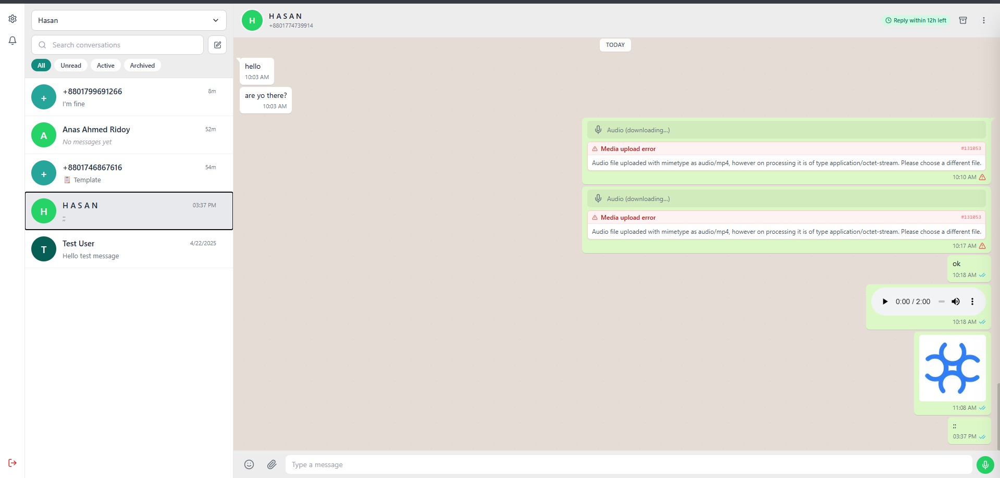
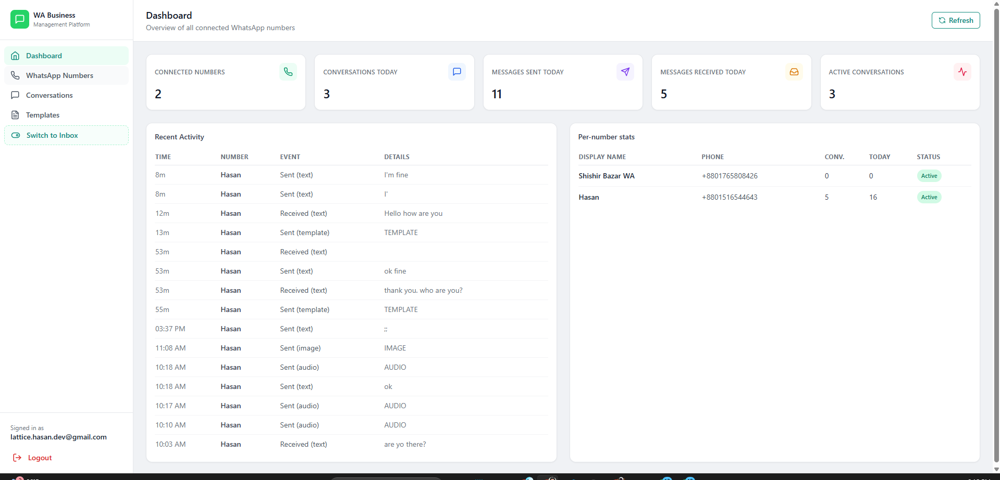

# WhatsApp Business Platform

A production-ready admin dashboard for managing WhatsApp Business conversations. Built with React, TypeScript, and Supabase. Supports multiple WhatsApp numbers, real-time messaging, media, templates, and contact management - all in a familiar WhatsApp Web style interface.

<br>

## 📸 Preview

### Inbox and Chat View



<br>

### Dashboard and Admin View



<br>

## 🎬 Video Demo

[](https://www.youtube.com/watch?v=3XslYjbphuc)

<br>

## ✨ Features

- **Multi-number inbox** - manage multiple WhatsApp Business numbers from one dashboard
- **Real-time conversations** - messages appear instantly via Supabase Realtime
- **Template messages** - send approved templates when the 24-hour window is closed
- **Media support** - send and receive images, videos, audio, and documents
- **Contact management** - add new contacts, view profiles, delete conversations
- **Message status** - sent, delivered, read, and failed states with error details
- **24-hour window tracking** - visual countdown before the messaging window expires
- **Error reporting** - detailed Meta API error cards with raw error codes
- **Swipe to reply** - swipe any message to quote-reply
- **Admin dashboard** - manage WhatsApp numbers, sync templates, view stats

<br>

## 🛠 Tech Stack

| Layer | Technology |
|---|---|
| Frontend | React 18, TypeScript, Vite, Tailwind CSS |
| Backend | Supabase (Postgres, Auth, Storage, Realtime) |
| Edge Functions | Deno (12 serverless functions) |
| Messaging API | Meta WhatsApp Cloud API |

<br>

## 📋 Prerequisites

Before you begin, make sure you have the following ready.

- **Node.js** version 18 or higher
- A **Supabase** account at [supabase.com](https://supabase.com)
- A **Meta Developer** account at [developers.facebook.com](https://developers.facebook.com) with a WhatsApp Business app

<br>

## 🚀 Setup Guide

### Step 1 - Create a Supabase Project

1. Go to [supabase.com](https://supabase.com) and sign in
2. Click **New Project**
3. Enter a project name and database password
4. Wait for the project to finish provisioning (about 1 minute)

<br>

### Step 2 - Collect Your Supabase Credentials

You need four values from Supabase. Here is exactly where to find each one.

<br>

**`VITE_SUPABASE_URL` and `VITE_SUPABASE_ANON_KEY`**

```
Supabase Dashboard
  → Your Project
    → Project Settings (left sidebar, gear icon)
      → API
        → Project URL          ← this is VITE_SUPABASE_URL
        → Project API Keys
            → anon / public    ← this is VITE_SUPABASE_ANON_KEY
```

> Link: `https://supabase.com/dashboard/project/YOUR_REF/settings/api`

<br>

**`SUPABASE_SERVICE_ROLE_KEY`**

```
Supabase Dashboard
  → Your Project
    → Project Settings
      → API
        → Project API Keys
            → service_role     ← click "Reveal" to copy
```

> ⚠️ Keep this key secret. Never expose it in the browser or commit it to git.

<br>

**`SUPABASE_ACCESS_TOKEN`**

This is your personal CLI token, not a project key.

```
Supabase Dashboard
  → Click your avatar (top right corner)
    → Account
      → Access Tokens
        → Click "Generate new token"
        → Give it a name (e.g. "whatsapp-platform")
        → Copy the token immediately (it is only shown once)
```

> Link: `https://supabase.com/dashboard/account/tokens`

<br>

### Step 3 - Clone and Install

```bash
git clone https://github.com/nova-hasan99/whatsap-cloud-api-ui.git
cd whatsap-cloud-api-ui
npm install
```

<br>

### Step 4 - Configure Environment Variables

Copy the example file and fill in your values.

```bash
cp .env.example .env.local
```

Open `.env.local` and fill in every field:

```env
# Supabase project URL
# Found at: Project Settings → API → Project URL
VITE_SUPABASE_URL=https://your-project-ref.supabase.co

# Supabase anonymous (public) key
# Found at: Project Settings → API → anon public
VITE_SUPABASE_ANON_KEY=eyJhbGciOiJIUzI1NiIsInR5cCI...

# Webhook URL (replace your-project-ref with your actual ref)
VITE_WEBHOOK_URL=https://your-project-ref.supabase.co/functions/v1/whatsapp-webhook

# Supabase service role key (secret, never expose to browser)
# Found at: Project Settings → API → service_role
SUPABASE_SERVICE_ROLE_KEY=eyJhbGciOiJIUzI1NiIsInR5cCI...

# Supabase personal access token for CLI deployment
# Found at: Account → Access Tokens → Generate new token
SUPABASE_ACCESS_TOKEN=sbp_your_token_here

# Admin account credentials (created automatically by npm run setup)
ADMIN_EMAIL=admin@yourdomain.com
ADMIN_PASSWORD=your_secure_password
ADMIN_NAME=Your Name
```

<br>

### Step 5 - Run Automatic Setup

One command sets up everything: database tables, admin user, storage bucket, and all edge functions.

```bash
npm run setup
```

This will run five steps automatically:

```
[1/5] Applying database schema (all tables, RLS policies, triggers)
[2/5] Creating admin auth user
[3/5] Seeding admin profile row
[4/5] Creating media storage bucket
[5/5] Deploying all 12 edge functions
```

> If setup fails on the functions step, your access token may have expired.
> Generate a new one (see Step 2) and update `.env.local`, then run:
>
> ```bash
> npm run deploy
> ```

<br>

### Step 6 - Start the App

```bash
npm run dev
```

Open your browser at `http://localhost:5173` and log in with the email and password from your `.env.local`.

<br>

## 📦 Available Scripts

```bash
# Start the development server
npm run dev

# Build for production
npm run build

# Preview the production build
npm run preview

# Type-check without building
npm run typecheck

# First-time full setup (DB + auth user + storage + deploy functions)
npm run setup

# Deploy or redeploy all edge functions
npm run deploy
```

<br>

## 🗂 Project Structure

```
whatsapp-business-platform/
├── src/
│   ├── main.tsx                    React entry point
│   ├── App.tsx                     Route definitions
│   ├── lib/
│   │   ├── supabase.ts             Supabase client and callFunction helper
│   │   ├── database.types.ts       TypeScript types for all DB tables
│   │   └── utils.ts                Date formatting, phone formatting, etc.
│   ├── contexts/
│   │   ├── AuthContext.tsx         Login/logout session management
│   │   └── ToastContext.tsx        Global toast notification system
│   ├── hooks/
│   │   ├── useNumbers.ts           WhatsApp numbers list
│   │   ├── useConversations.ts     Conversation list with realtime sync
│   │   ├── useMessages.ts          Message pagination and realtime
│   │   ├── useTemplates.ts         Template list per number
│   │   └── useNotifications.ts     Browser notification on inbound messages
│   ├── components/
│   │   ├── ui/                     Button, Input, Modal, Avatar, Badge, Dropdown, etc.
│   │   ├── layout/                 Sidebar, AdminLayout, ProtectedRoute
│   │   ├── admin/                  StatCard, NumberFormModal, NumberProfileModal
│   │   └── inbox/                  ConversationsList, ChatArea, MessageBubble,
│   │                               ChatFooter, TemplateSelector, ContactPanel,
│   │                               NewContactModal, MediaLightbox, and more
│   └── pages/
│       ├── LoginPage.tsx
│       ├── DashboardPage.tsx
│       ├── NumbersPage.tsx
│       ├── TemplatesPage.tsx
│       └── InboxPage.tsx
├── supabase/
│   ├── config.toml                 Local Supabase config
│   ├── migrations/
│   │   └── 20260101000000_initial_schema.sql   Full DB schema with RLS
│   ├── seed.sql                    Default admin profile row
│   └── functions/
│       ├── _shared/                CORS, Supabase admin client, Meta API helpers
│       ├── whatsapp-webhook/       Inbound messages and status updates
│       ├── send-message/           Send text and media messages
│       ├── send-template/          Send template messages
│       ├── mark-read/              Mark conversations as read
│       ├── fetch-templates/        Sync templates from Meta
│       ├── test-connection/        Verify WhatsApp number credentials
│       ├── upload-media/           Upload media to Storage and Meta
│       ├── log-message/            Log outbound messages
│       ├── update-profile/         Update WhatsApp Business profile
│       ├── create-conversation/    Start a new conversation by phone number
│       └── delete-conversation/    Delete a conversation and all its media
├── scripts/
│   ├── setup.js                    Full one-command setup script
│   └── deploy-functions.js         Deploy all edge functions
├── .env.example                    Template for environment variables
└── package.json
```

<br>

## 🔐 Security Notes

**RLS is enabled** on all tables. Only authenticated users can read or write data.

**Service role key** is only used inside edge functions and the setup script. It is never sent to the browser.

**Access tokens** for WhatsApp numbers are stored in the database. For production deployments, consider encrypting them using [Supabase Vault](https://supabase.com/docs/guides/database/vault) or [pgsodium](https://github.com/michelp/pgsodium).

<br>

## 🐛 Troubleshooting

**"Failed to fetch" when sending a message**

Your edge functions may not be deployed yet. Run:

```bash
npm run deploy
```

**Webhook not receiving messages**

Check that your Callback URL in Meta is correct and that you subscribed to the `messages` field. The URL must be publicly accessible (not localhost).

**Duplicate conversations appearing**

This happens when phone numbers are stored in different formats. The latest version normalizes all numbers to E.164 format (`+8801234567890`). Make sure you have deployed the latest `whatsapp-webhook` function.

**Access token expired (401 error on deploy)**

Generate a new personal access token from:

```
Supabase Dashboard → Click avatar (top right) → Account → Access Tokens → Generate new token
```

Update `SUPABASE_ACCESS_TOKEN` in `.env.local` and run `npm run deploy` again.

<br>

## 📄 License

MIT
